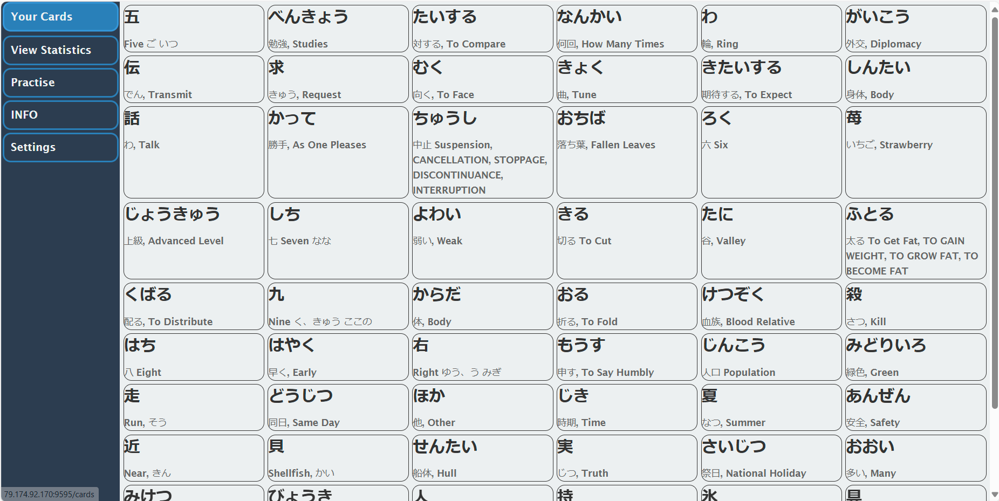
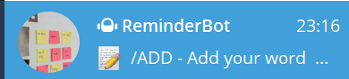
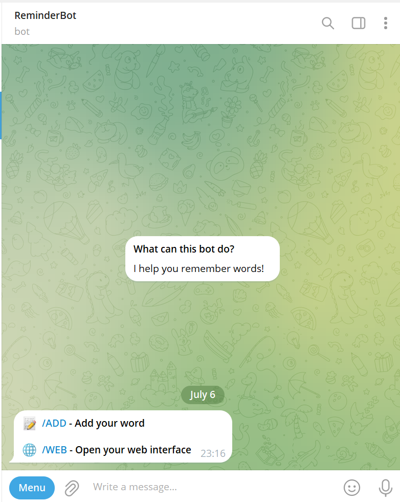

# RemindMe Project

## Description
The RemindMe is a Java-based application designed to help users learn new words or information. It leverages the Spring Boot framework for its backend and integrates with a Telegram bot for interactive user engagement.

## Features
- Learn and practice words or information.
- Interactive Telegram bot integration.
- User progress tracking and management.
- Secure user authentication and authorization.

## Screenshots
### Web Interface
![RemindMe Web Interface]


*The web interface of RemindMe showing the dashboard where users can track their progress.*

### Telegram Bot Interface
![RemindMe Telegram Bot](


*The Telegram bot interface of RemindMe where users can interact and learn words or information.*

## Prerequisites
- Java 17
- Maven
- PostgreSQL

## Getting Started

To start using the RemindMe Bot, simply follow this link and join the bot on Telegram:

[Join YuriHomeworkReminderBot](https://t.me/yurihomeworkreminderbotThis bot will assist you in learning and practicing words or information, tracking your progress, and much more!


## Installation

### Clone the repository
\```bash
git clone https://github.com/YuriPetukhov/RemindMe
cd kanji-reminder
\```

### Configure PostgreSQL
Ensure you have PostgreSQL installed and running. Create a new database and update the `application.properties` file with your database credentials.

### Build the project
\```bash
mvn clean install
\```

### Running the application
Execute the following command to run the application:
\```bash
java -jar target/reminder-0.0.1-SNAPSHOT.jar
\```

## Dependencies
The project uses the following dependencies:
- Spring Boot Starter Web
- PostgreSQL Driver
- Lombok
- Liquibase
- Java Telegram Bot API
- Spring Boot Starter Data JPA
- JavaX Annotation API
- Spring Data Commons
- Swagger Annotations
- Springdoc OpenAPI UI
- MapStruct for object mapping
- Spring Security

## License
This project is licensed under the MIT License - see the LICENSE.md file for details.